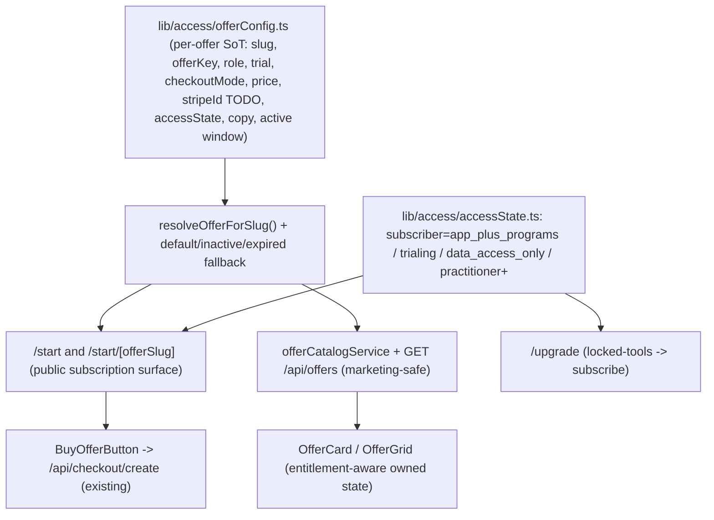

## app-marketing-offers-v1 (revised: app start + configurable offers)

Controlling scope: bridge packet `1d4c4cb2-e31d-426a-a7e8-ac60ab649311` (thread `FD-PLATFORM:app-marketing-offers-v1`). Primary deliverable is the Fine Diet app subscription/start surface and configurable offer system - NOT a general `/shop` buildout. `/shop` is reserved for the later physical-items commerce track and is out of scope here.

### Product model (core offer decisions - locked)
- Standard Fine Diet subscription is the baseline offer: grants app access PLUS Fine Diet programs as they run (access state `app_plus_programs`).
- Programs may have natural completion gating; subscription does not auto-enroll.
- Practitioner-supported offers are separate premium experiences layered ABOVE the baseline app/program subscription.
- No traditional free tier.
- Expired-trial users keep account + saved-data access only (`data_access_only`); active tools lock until subscription.
- Trial length, checkout mode, pricing, Stripe IDs, and entitlement counts are configurable per offer (placeholders/TODOs where final values are not yet available).

### Verified current state (research)
- `offers` table holds Stripe/billing fields only (`scripts/sql/alterOffersForStripe.sql`): `billing_model`, `stripe_price_id`, `stripe_phase_price_ids/iterations`, `success_path`, `cancel_path`. No presentation or trial/state metadata.
- Checkout path is solid and reused: [components/checkout/BuyOfferButton.tsx](components/checkout/BuyOfferButton.tsx) -> [pages/api/checkout/create.ts](pages/api/checkout/create.ts) (loads offer, resolves `offer_entitlements`, 409 `already_entitled`).
- Entitlement registry is coarse today (`docs/access/ENTITLEMENT-KEY-REGISTRY.md`, [lib/access/constants.ts](lib/access/constants.ts)): `journal`, `program:<slug>`, `care:integrative`, `feature:*`. Enforced via [lib/access/accessService.ts](lib/access/accessService.ts) (`hasEntitlement`, `hasJournalAccess`) and `middleware.ts`. Verifier: `scripts/verifyEntitlementRegistry.ts`.
- Hardcoded offer CTAs exist in [pages/home.tsx](pages/home.tsx), [app/journal-waitlist/WaitlistForm.tsx](app/journal-waitlist/WaitlistForm.tsx), [pages/programs.tsx](pages/programs.tsx).

### Architecture

### Phase 1 - Configurable offer system (foundation)
- New `lib/access/offerConfig.ts` (code-owned SoT) - typed per-offer config:
  - `slug` (URL for `/start/[offerSlug]`), `offerKey` (links to `offers` DB + checkout)
  - `role`: `default-public` | `launch-event` | `buy-now`
  - `isActive` + optional active window (`startsAt`/`endsAt`) -> drives inactive/expired fallback
  - `trialDays` (number; `0`/null = no trial; buy-now skips trial copy)
  - `checkoutMode`: `trial` | `buy_now` | `subscription` (maps to existing `billing_model`)
  - `priceLabel` (display) + `stripePriceId` (placeholder TODO unless already in `offers`)
  - `grantsAccessState`: `app_plus_programs` (+ optional `practitioner`)
  - `entitlementKeys[]` (placeholder counts), `copy` block (hero title/sub, CTA label, trial copy)
- New `lib/access/offerConfigResolver.ts`: `resolveOfferForSlug(slug?)` -> exact match, else `default-public`; inactive/expired -> fallback to default with a notice flag.
- Keep the catalog/API as supporting infra: `lib/access/offerCatalogService.ts` + `pages/api/offers/index.ts` (`GET`, marketing-safe, never returns Stripe IDs), reusing `resolveEffectiveOfferEntitlementMappings`.

### Phase 2 - Access-state model + entitlement mapping
- New `lib/access/accessState.ts`: resolves a person to one state and the gates it grants:
  - `subscriber` -> `app_plus_programs` (all active tools + programs)
  - `trialing` -> same as subscriber within trial window
  - `data_access_only` (expired trial / lapsed) -> read-only account + saved data; all create/generate/start gates locked
  - `practitioner` -> adds `practitioner.support.access` above baseline
- Entitlement reconciliation (item 7): all proposed gate families are NEW and use dot-notation, which differs from the registry's colon convention enforced by `scripts/verifyEntitlementRegistry.ts`. Decision to confirm at implementation: adopt the dotted "capability gate" taxonomy as a NEW tier distinct from coarse `journal`/`program:`/`care:` keys, and update the verifier + registry naming rules accordingly. Mapping:

  - Covered today only at a COARSE level by `journal`: `journal.entry.view_own`, `journal.entry.create`, `recipes.view_saved`, `recipes.save`, `meal_schedule.view`, `meal_schedule.create`, `grocery.list.view`, `grocery.list.create`, `pantry.item.view`, `pantry.item.create` (new granular gates; today `journal` is all-or-nothing).
  - Partially related to existing `feature:plans-*`: `recipes.import` (~`feature:plans-recipe-video-import`), `insights.ai.generate` (~`feature:plans-ai-generate`) - new, distinct.
  - Related to `program:<slug>` + runtime: `programs.start`, `programs.step.continue` (cross-cut existing program gates) - new.
  - Related to `care:integrative`: `practitioner.support.access` (premium layer; may alias `care:integrative`) - new.
  - No existing coverage (all new): `account.data.view`, `billing.upgrade.view`, `assessments.start`, `assessments.results.view_history`, `assessments.results.generate`, `programs.catalog.view`, `programs.history.view`.
- v1 entitlement scope: produce the mapping doc + register the new keys as placeholders in `ENTITLEMENT-KEY-REGISTRY.md` + `constants.ts` (run `npm run verify:entitlements`), and enforce only what the `/start` + trial/expired/active-lock behavior needs via `accessState.ts`. Per-tool granular enforcement is staged as follow-up TODOs (entitlement counts remain placeholders unless available).

### Phase 3 - /start, /start/[offerSlug], /upgrade surfaces
- New `pages/start/index.tsx` -> resolves `default-public` offer; subscription-framed hero (app + programs baseline), trial copy from config, `BuyOfferButton` with the offer's `offerKey`.
- New `pages/start/[offerSlug].tsx` -> resolves by slug; supports launch-event (different `trialDays`), buy-now (skips trial copy), and inactive/expired -> default-offer fallback with notice.
- New `pages/upgrade.tsx` -> target for logged-in `trialing`/`data_access_only` users hitting locked tools; routes into checkout/subscribe.
- Practitioner-supported offers rendered as a clearly separate premium section, not mixed into the baseline subscription CTA.
- Reusable UI: `components/offers/OfferCard.tsx` + `OfferGrid.tsx` (entitlement-aware owned state via `lib/access/useOffers.ts`, mirroring checkout 409). Supersede the unmounted `AccessCard`/`RecommendationCard` (mark deprecated in `lib/moduleRegistry.ts`, no deletion).

### Phase 4 - Targeted CTA cleanup (only as needed)
- Refactor hardcoded offer CTAs to the new config/OfferCard ONLY where they support the start/upgrade surface (e.g. point [pages/home.tsx](pages/home.tsx) and [app/journal-waitlist/WaitlistForm.tsx](app/journal-waitlist/WaitlistForm.tsx) subscription CTAs at `/start`). Do not do a broad marketing-wide refactor in this pass.

### Phase 5 - Checkout return routing (onboarding / start, NOT /home or /shop)
Requirement added before the Stripe/card-required trial work: app subscription offers must return users into the onboarding/start surface, never `/home` or `/shop`.

> v1 DECISION (implemented): success routes directly to `/app/onboarding`; cancel routes to `/start` (or real `/start/<offerSlug>`). No `/checkout/success` bridge for v1 — verified [pages/api/webhooks/stripe.ts](pages/api/webhooks/stripe.ts) grants entitlements server-side on `checkout.session.completed` (signature-verified + idempotent), so the success page needs no Stripe/session verification. API fallbacks in [pages/api/checkout/create.ts](pages/api/checkout/create.ts) changed `'/home'`->`'/app/onboarding'` and `'/shop'`->`'/start'`. Admin warnings/placeholders ([pages/admin/offers.tsx](pages/admin/offers.tsx)), offers column comments ([scripts/sql/alterOffersForStripe.sql](scripts/sql/alterOffersForStripe.sql)), and [docs/payments/STRIPE-SETUP.md](docs/payments/STRIPE-SETUP.md) updated to match.

- Verified current behavior in [pages/api/checkout/create.ts](pages/api/checkout/create.ts):
  - success: `absoluteUrl(o.success_path || '/home') + '?checkout=success'`
  - cancel: `absoluteUrl(o.cancel_path || '/shop') + '?checkout=canceled'`
  - i.e. the `?checkout=...` query is appended by the API, so `success_path`/`cancel_path` should be bare paths without the query.
- Verified existing routes (use these canonical paths; the literal `/onboarding` and `/start/launch` in the request do NOT exist yet):
  - App onboarding route is `/app/onboarding` ([pages/app/onboarding.tsx](pages/app/onboarding.tsx) re-exports [pages/journal/onboarding.tsx](pages/journal/onboarding.tsx)). There is no top-level `/onboarding`.
  - App home is `/app` ([pages/app/index.tsx](pages/app/index.tsx)).
  - Start surface is `/start` + `/start/[offerSlug]` (Phase 3). No `/start/launch` slug exists yet; the launch-event offer's actual slug from `offerConfig` must be used.

- Successful checkout / trial confirmation routing:
  - Route to onboarding, not `/home`/`/app`. Canonical: `success_path = /app/onboarding` -> final URL `/app/onboarding?checkout=success`.
  - If onboarding gating is not finalized at implementation time, add a lightweight bridge route `pages/checkout/success.tsx` (`/checkout/success`) that verifies the `?checkout=success` state (and ideally session/entitlement) and forwards to `/app/onboarding`, falling back to `/app` if onboarding is unavailable. In that case set `success_path = /checkout/success`.

- Canceled checkout routing:
  - Route back to the app start surface, not `/shop`. Canonical fallback: `cancel_path = /start` -> final URL `/start?checkout=canceled`.
  - For slug-specific offers, preserve offer context where practical: `cancel_path = /start/<offerSlug>` (using the real configured slug), final URL `/start/<offerSlug>?checkout=canceled`.

- Offer-level paths (source of truth = `offers.success_path` / `offers.cancel_path`):
  - Always honor per-offer `success_path`/`cancel_path` when present (already supported by the API).
  - For the new app subscription offers, set:
    - `success_path = /app/onboarding` (or `/checkout/success` bridge if onboarding not finalized)
    - `cancel_path = /start` (or the relevant `/start/<offerSlug>` for slug-specific offers)
  - Do NOT use `/shop` for any app subscription cancel path (`/shop` is reserved for the later physical commerce track).

- Implementation touchpoints:
  - Change the API fallbacks in [pages/api/checkout/create.ts](pages/api/checkout/create.ts) from `'/home'` -> `'/app/onboarding'` (or `/checkout/success`) and `'/shop'` -> `'/start'`, so even offers missing explicit paths never land on `/home` or `/shop`.
  - Seed/document `success_path`/`cancel_path` for the new offers in the offers SQL/seed and mirror in `offerConfig` notes.

### Visual direction
- Use the integrative-care page only as a loose visual/style reference; do NOT clone its content structure. `/start` should read as the central app access + subscription page, not another program landing page.

### Guardrails
- No `/shop` work in this pass (reserved for later physical-items track). `/shop` must not be used as a checkout success or cancel destination for app subscription offers.
- Checkout returns must land on onboarding/start, never `/home` or `/shop` for app subscription offers.
- Do not auto-enroll users into programs from marketing or checkout (no `program_enrollments`).
- Do not mutate live Stripe config or switch live traffic. Stripe price IDs + final entitlement counts stay placeholders/TODOs unless already available.
- Do not change Plans logic. `/api/offers` never exposes Stripe price IDs.
- New entitlement keys must pass `npm run verify:entitlements`.

### V1 acceptance criteria
- `/start` loads the default public offer.
- `/start/[offerSlug]` loads the matching configured offer.
- Launch-event offer can use a different trial length than the public offer.
- Buy-now offer can skip trial copy.
- Inactive/expired offer slug falls back to the default public offer.
- Expired-trial state is `data_access_only` (account + saved data read-only), not a free tier; active tools lock.
- Copy frames the standard subscription as app + programs baseline.
- Practitioner-supported offers are clearly separate from baseline.
- No `/shop` work; Stripe IDs + entitlement counts remain placeholders/TODOs unless available.
- Existing hardcoded CTAs refactored only where needed to support this surface.
- No program auto-enroll from marketing or checkout.
- Public 14-day card-required trial returns to onboarding (`/app/onboarding?checkout=success`, or the `/checkout/success` bridge -> onboarding) after successful Stripe confirmation.
- Launch 30-day card-required trial returns to onboarding after successful Stripe confirmation.
- Buy-now offer returns to onboarding or app access confirmation after successful payment.
- Any canceled app-offer checkout returns to `/start` (or the relevant `/start/<offerSlug>`), never `/home` or `/shop`.
- No app subscription offer uses `/shop` as its cancel fallback; API fallbacks default to onboarding/start, not `/home`/`/shop`.

### Validation
- `npx tsc --noEmit` clean for changed files; `ReadLints` on all new/edited files.
- Manual: `/start` (default), `/start/[offerSlug]` for default/launch/buy-now/inactive; trial vs buy-now copy; expired-trial data-access-only + tool lock; `/upgrade` path; checkout still reaches Stripe and 409 already-entitled works.
- Manual checkout routing: confirm successful checkout lands on onboarding (`/app/onboarding?checkout=success` or `/checkout/success` bridge), canceled checkout lands on `/start` / `/start/<offerSlug>?checkout=canceled`, and no app offer (incl. missing-path fallbacks) routes to `/home` or `/shop`.
- `npm run verify:entitlements` passes after registering new placeholder keys.
</plan>
<todos>[{"id": "offer-config", "content": "Create lib/access/offerConfig.ts (per-offer SoT: slug, offerKey, role default-public/launch-event/buy-now, trialDays, checkoutMode, priceLabel, stripePriceId TODO, grantsAccessState, entitlementKeys, copy, active window) + offerConfigResolver.ts with default/inactive/expired fallback"}, {"id": "catalog-api", "content": "Add supporting lib/access/offerCatalogService.ts + GET /api/offers (marketing-safe, no Stripe IDs), reusing resolveEffectiveOfferEntitlementMappings"}, {"id": "access-state", "content": "Create lib/access/accessState.ts (subscriber=app_plus_programs / trialing / data_access_only / practitioner+) resolver driving tool lock vs data-only read access"}, {"id": "entitlement-map", "content": "Document existing-vs-new gate mapping; register proposed dotted capability gates as placeholders in ENTITLEMENT-KEY-REGISTRY.md + constants.ts; update verifier naming rules; run verify:entitlements"}, {"id": "offercard", "content": "Build components/offers/OfferCard.tsx + OfferGrid.tsx + lib/access/useOffers.ts (entitlement-aware owned state); deprecate unmounted AccessCard/RecommendationCard in moduleRegistry"}, {"id": "start-pages", "content": "Add pages/start/index.tsx (default public offer), pages/start/[offerSlug].tsx (slug match + launch/buy-now/inactive fallback), pages/upgrade.tsx (locked-tools -> subscribe); subscription-framed copy, practitioner offers separate"}, {"id": "cta-cleanup", "content": "Point home.tsx + journal-waitlist subscription CTAs at /start only where needed (no broad marketing refactor; no /shop)"}, {"id": "checkout-routing", "status": "completed", "content": "DONE (v1): changed API fallbacks in pages/api/checkout/create.ts /home->/app/onboarding and /shop->/start; no /checkout/success bridge (webhook grants entitlements server-side); updated admin warnings/placeholders, offers SQL comments, STRIPE-SETUP.md. Remaining for offer-build phase: set explicit offers.success_path=/app/onboarding and cancel_path=/start (or /start/<offerSlug>) per app subscription offer"}, {"id": "validate", "content": "Typecheck + ReadLints; manually verify default/launch/buy-now/inactive offers, trial vs buy-now copy, expired data-access-only + tool lock, /upgrade, checkout/409; run verify:entitlements"}]