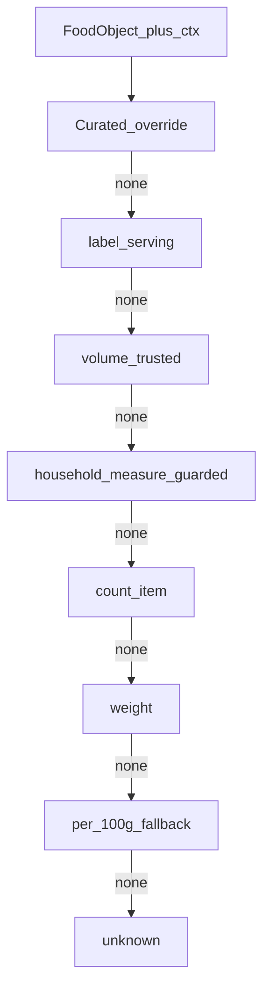

# Fine Diet: default intake / serving-default — **V1 implementation spec**

This document is the **implementation-ready V1** spec. It preserves the prior architecture (nutrition basis vs default intake vs conversion math) while locking decisions, tightening rules, and scoping what ships now vs later.

**Baseline code:** `[FoodObject](lib/food/types.ts)`, `[computeQuantities](lib/units/convert.ts)`, `[OffServingNormalization](lib/food/types.ts)` / `[offNormalization.ts](lib/food/offNormalization.ts)`, `[getDefaultIntakeQuantityAndUnit](lib/units/convert.ts)` (**must** be removed or delegate—see §8), `[pages/journal/log.tsx](pages/journal/log.tsx)` `handleLogFood`.

---

## 1. V1 hard decisions locked

These are **non-negotiable for V1** implementation and review:

### 1.1 Rounded consumer-friendly liquid constants (V1 only)

Use **one global table** for generic liquid **volume ↔ volume** helpers when no food-specific `measures` row exists:


| Unit   | V1 fixed value |
| ------ | -------------- |
| 1 tsp  | **5 ml**       |
| 1 tbsp | **15 ml**      |
| 1 cup  | **240 ml**     |


- **Do not** mix in precise NIST values in V1 UI math—stay consistent with the table above.
- **Do not infer density** in V1 (mass ↔ volume) **unless** there is a **food-specific** known conversion (e.g. a `measures` entry with `grams`, or an explicit label-equivalent row). No “guess oil density from category.”

### 1.2 `qtyOverride` invariant (hard)

`**qtyOverride` is always:** a **multiplier of the food’s resolved default intake profile’s “one log”** (the `defaultQuantity` + `defaultUnit` pair from `resolveDefaultIntakeProfile`).

- **No call site** may reinterpret `qtyOverride` as raw servings, raw grams, or anything else.
- Effective log = `(defaultQuantity * qtyOverride, defaultUnit)` as quantity in that unit (same semantics as user typing that multiple).

**Examples (must match tests and code comments):**


| Default profile | `qtyOverride` | Result                          |
| --------------- | ------------- | ------------------------------- |
| 1 tbsp          | 2             | **2 tbsp**                      |
| 28 g            | 2             | **56 g**                        |
| 1 slice         | 2             | **2 slices** (unit stays slice) |
| 1 bar           | 2             | **2 bars**                      |
| 1 cup           | 2             | **2 cups**                      |
| 1 serving       | 2             | **2 servings**                  |


If `qtyOverride` is omitted, treat as **1**.

### 1.3 Defaults are not chosen by “search”

- **Search ranking** must not determine default intake.
- **Default intake is computed** from `**FoodObject` + source metadata** (e.g. `OffServingNormalization` when present) at the point of logging or when previewing—**not** from search position, query string, or result section.

### 1.4 OFF must stay conservative

- When OFF serving metadata is **weak**, V1 defaults must be **conservative** (e.g. per-100g-style fallback, minimal alternates)—see section 6.
- Raw OFF must **not** become the richest or most aggressive default source in V1.

### 1.5 Incremental implementation

- Ship `**resolveDefaultIntakeProfile(food, ctx)`** and wire `**handleLogFood`** (and any shared helper used for the same shape of payload).
- **Keep** `[computeQuantities](lib/units/convert.ts)` as the backbone for quantity → `servingQty` / `quantityG` when the stored journal pipeline expects it.
- **Avoid** large ingestion or search refactors solely for defaults in V1.

---

## 2. Recommended data / default model

### 2.1 Separation of concerns (preserve)


| Layer                      | Role                                                                                                                                                   |
| -------------------------- | ------------------------------------------------------------------------------------------------------------------------------------------------------ |
| **Nutrition basis**        | What stored macros represent (`per_serving` vs `per_100g`, etc.). Must stay consistent with how `servingSizeG` and nutrients combine in existing code. |
| **Default intake profile** | What we suggest for the **first tap** (quantity + unit + label copy + confidence). **Computed** in V1; optional DB fields in V2.                       |
| **Conversion**             | How user input in a chosen unit maps to grams / serving multiplier—`[computeQuantities](lib/units/convert.ts)` remains central.                        |


### 2.2 `DefaultIntakeProfile` (V1 computed struct)

```ts
type DefaultStrategy =
  | 'label_serving'
  | 'household_measure'
  | 'volume'              // see section 5 — liquid-first, trusted ml/cup path
  | 'count_item'
  | 'weight'
  | 'per_100g_fallback'
  | 'unknown';

interface DefaultIntakeProfile {
  strategy: DefaultStrategy;
  defaultQuantity: number;
  defaultUnit: string; // 'serving' | 'g' | measure key, etc.
  servingLabel: string | null;
  unitConfidence: 'exact' | 'label_based' | 'food_specific' | 'generic_fallback' | 'unknown';
  rationale?: string; // dev/support; optional UI “why” later
}
```

- **V1:** implement as pure/deterministic resolution from food + `ctx` (see section 8).
- **Do not** require new DB columns for V1 unless a tiny migration is already in flight—prefer compute-time.

### 2.3 Relationship to existing `FoodObject` fields

- Continue using `servingSizeG`, `servingUnit`, `servingDescription`, `householdServingText`, `measures`.
- `nutritionBasis` may be **implicit** in V1 code paths; document invariants next to `computeQuantities` call sites if not yet a first-class field everywhere.

---

## 3. Unit taxonomy

**Unchanged from prior plan, tightened for V1:**

- **Internal canonical mass:** `g` (journal pipeline derives `quantity_g` as today).
- **Abstract:** `serving` = multiplier vs label serving when nutrients are per serving and `servingSizeG` is the grams per that serving.
- **Food-specific measures:** any `measures[].unit` supported by `[findMeasure](lib/units/convert.ts)`—primary path for **trusted** tbsp/slice/bar when a row exists.
- **Global mass units** (oz, lb, kg): optional in alternates if wired through conversion helpers **without** breaking `computeQuantities` invariants—only if V1 scope allows; otherwise defer alternates expansion.

**Volume-first UX units:** `cup`, `tbsp`, `tsp`, `ml`, `fl oz`, `l`—use **only** with locked constants (section 1) or **food-specific** measures; see section 4.

---

## 4. Conversion hierarchy

**Order of trust for V1:**

1. **Food-specific measure** — `measures[]` with `grams` (exact for that food’s declared portion).
2. **Label-consistent text** — `householdServingText` / `servingDescription` that **clearly names** a unit matching a measure or a resolvable serving (→ `label_based`).
3. **Generic liquid volume** — **only** for volume↔volume using **section 1 constants**; mark `generic_fallback` when no measure row.
4. **Global mass constants** — g↔oz↔lb via fixed factors (if exposed in V1).
5. **Never** in V1: inferred density or “category-based” mass↔volume without a measure.

**Precision labeling:**

- **Exact:** measure row from USDA/curated with grams.
- **Label-based:** serving text aligns with `servingSizeG` / measure.
- **Generic fallback:** constants only (5/15/240 ml), or per-100g OFF fallback.

---

## 5. Default-strategy decision tree (V1)

**Precondition:** Resolution uses `**FoodObject` + `ctx`** (OFF normalization when logging an OFF result). **Not** search.

**Evaluation order (first satisfying, eligible branch wins):**

1. **Curated / explicit override (V2 or code-seeded only in V1)**
  If present: use it; confidence `exact`.
2. `**label_serving`**
  Non–gram-native label serving where `**1` × `serving`** is the correct concrete default (e.g. container/serving units not expressed as gram-native `servingUnit`).  
   **Do not** use this branch for **gram-native branded** items—those are locked in **§1.6** (`**weight`**: `servingSizeG` × `g`).
3. `**volume` (included in V1)**
  Use when **all** hold:
  - Liquid or pourable is indicated by **trusted** signals (not category-only): e.g. `measures`/`label` includes **cup** or **ml**/**fl oz**, or `householdServingText` clearly states a **volume** portion; **and**
  - Default should read naturally as **1 cup** / **240 ml** / **8 fl oz** style—not a dry **tbsp** default.  
   **Purpose:** clarity for milk, juice, broth, creamer, dressings, liquid supplements when data supports it **without** broad heuristics.  
   If the best you have is **only** generic constants and **no** trusted row or clear label, prefer `**household_measure`** with low confidence or fall through—**do not** pretend precision.
4. `**household_measure` (tightened — section 5.1)**
  tbsp/tsp/cup for spreads, oils, sugar, etc. **Only** if section 5.1 allows.
5. `**count_item`**
  slice / bar / container / cookie when **trusted** measure row **or** label clearly names the item unit (section 5.1).
6. `**weight`**
  **Gram-native** label servings (including **gram-native branded**—§1.6): `**defaultQuantity = servingSizeG`**, `**defaultUnit = 'g'`** when `servingSizeG` > 0 and no higher branch applied. Other weight-first cases without a better branch follow the same concrete gram output when grams are the chosen default.
7. `**per_100g_fallback`**
  When nutrients are per 100 g and a conservative default is required (especially weak OFF): **always** §1.7 — `**100` × `g`** only.
8. `**unknown`**
  Minimal safe default + limited alternates.

### 5.1 Household-measure guardrails (V1 — do not overfire)

Allow `**household_measure`** defaults **only if at least one** is true:

- There is an **explicit trusted `measures` row** with gram support (and optionally ml in V2); **or**
- The **label clearly names** the household unit in `householdServingText` / `servingDescription` in a way that can be matched to a measure or constant; **or**
- A **curated override** exists (V2 DB or temporary code table).

**Do not** select tbsp/cup primarily from **loose category/tags alone** in V1. Category may **break ties** between two **already-eligible** measures, not create eligibility from nothing.

### 5.2 Why `volume` is separate from `household_measure`

- **household_measure:** cooking units (often **tbsp/tsp**) and dry **cup** where USDA encodes **weight** via `measures[].grams`.
- **volume:** user mental model is **liquid volume** (milk carton, juice, broth)—default may be **1 cup** or **240 ml** with **volume** strategy for explainability and tuning, even when the math still flows through `measures` or locked ml↔cup constants.

If product prefers a single enum value, `**volume` can be implemented as a sub-flag** inside `household_measure`; the spec recommends **distinct `volume`** for V1 **clarity and telemetry**.

### 5.3 `volume` — V1 implementation constraint (no extra engine)

- **Do not** build a **separate** conversion engine for `volume` in V1.
- `**volume` and `household_measure` may share the same mechanics** (same `computeQuantities` path, same `measures` / locked liquid constants). The `**volume` strategy value** is for **reasoning, logging, and telemetry**, not a parallel math stack.
- If maintaining two enum values adds complexity without benefit, `**volume` may be collapsed to `household_measure` in code** while preserving **distinct `strategy`** in profile output via a **tag** or **sub-reason**—optional optimization; default is keep `**volume`** in the type if cost is low.




---

## 6. Source-specific rules (USDA / OFF / curated / custom)

### 6.1 USDA (branded and others)

- Prefer **trusted `measures`** + **clear label text** before category guesses.
- Branded gram servings (28 g): `**weight`** or `**label_serving`** → **28 g** or **1 serving**, not **1 g**.

### 6.2 OFF (conservative)

- **Strong** serving metadata (`serving_confidence` high, parsed `serving_size_g` usable, normalization consistent): may use `**label_serving`** or `**volume`** / `**household_measure`** only when section 5.1 is satisfied.
- **Weak** metadata: `**per_100g_fallback`** (e.g. **100 g**), `**generic_fallback`**, **fewer alternates**—do not expose aggressive cup/tbsp stacks from noisy OFF alone.
- OFF must **not** outrank curated/USDA in default richness when data is thin.

### 6.3 Curated / Fine Diet

- Highest trust for intentional defaults when you add overrides (V2 DB or V1 constants in code).
- `**exact`** confidence when hand-authored.

### 6.4 User custom foods

- Treat user-entered serving as **authoritative** for “one log”; `**exact`** where the user defined serving fields clearly.
- `**qtyOverride`** still multiplies that resolved profile—same invariant.

---

## 7. UI / default display behavior

**Primary display** must show the **default profile’s unit**, not an arbitrary preference for grams:


| Resolved default | Primary display |
| ---------------- | --------------- |
| 1 tbsp           | **1 tbsp**      |
| 1 cup            | **1 cup**       |
| 28 g             | **28 g**        |
| 1 slice          | **1 slice**     |
| 1 bar            | **1 bar**       |


**Secondary / reference:**

- Optionally show **grams** (or equivalent) **when exact and useful**—e.g. small subtitle “28 g” under a serving line, or “~15 g” **only** when policy allows and confidence is not `unknown`.

**Do not:**

- Force **grams** as primary when **tbsp / tsp / cup / item** is the resolved default.
- Force **household** when **grams** is the resolved default (e.g. nuts 28 g).

**Alternates:** same spirit as before—default first, then sensible alternates; suppress noisy units when confidence is `unknown` or OFF is weak.

---

## 8. Implementation guidance (current codebase)

**Recommended V1 shape:**

1. Add `**resolveDefaultIntakeProfile(food, ctx)`**
  - **Suggested location:** `lib/food/defaultIntake.ts` (keeps `[convert.ts](lib/units/convert.ts)` focused on math), re-export if helpful.  
  - `**ctx` must include** whatever is needed **without search**: e.g. `{ offNormalization?: OffServingNormalization }`.
2. Replace/supersede `**getDefaultIntakeQuantityAndUnit`**
  - Implement in terms of `**resolveDefaultIntakeProfile`** or delete after migration to avoid two sources of truth.
3. `**handleLogFood`** (`[pages/journal/log.tsx](pages/journal/log.tsx)`)
  - Compute `profile = resolveDefaultIntakeProfile(food, ctx)`.  
  - Set `quantity = profile.defaultQuantity * (qtyOverride ?? 1)`, `unit = profile.defaultUnit`.  
  - Pass through to `journalService.createEntry` as today; ensure `**computeQuantities`** usage downstream unchanged for API that expects stored unit/quantity.
4. **Ingestion / search**
  - No large refactor required; ensure OFF results **attach** `offNormalization` into `ctx` when resolving profile for that food.
5. **Comments + single docstring**
  - Centralize `**qtyOverride`** meaning in the `handleLogFood` docstring and in `**resolveDefaultIntakeProfile`** export.
6. **Tuneability**
  - Keep `**rationale`** (optional) for debugging.  
  - Prefer **small, explicit** allowlists (e.g. label regex helpers) over ML.

---

## 9. Test matrix (V1)

**Fixture-level tests** (unit tests for `resolveDefaultIntakeProfile` + integration with `computeQuantities`):


| #   | Case                                                     | Expected default (locked / typical)                                                                 | Confidence (typical)               |
| --- | -------------------------------------------------------- | --------------------------------------------------------------------------------------------------- | ---------------------------------- |
| 1   | USDA branded almonds, 28 g gram-native label             | `**28` × `g`** only (§1.6); strategy `**weight`**                                                   | `label_based`                      |
| 2   | OFF-style per-100g, strong parsing                       | Strong metadata: per tree (e.g. label path); **if `per_100g_fallback` → always `100` × `g`** (§1.7) | `generic_fallback` / `label_based` |
| 3   | Peanut butter, `measures` has tablespoon                 | **1 tbsp**                                                                                          | `exact` / `label_based`            |
| 4   | Olive oil, tbsp measure + label                          | **1 tbsp**                                                                                          | `exact` / `label_based`            |
| 5   | Milk, cup or volume path trusted                         | **1 cup** (or **240 ml** if that is the concrete resolved default)                                  | `label_based` / `generic_fallback` |
| 6   | Bread, `slice` in measures                               | **1 slice**                                                                                         | `exact`                            |
| 7   | Yogurt cup, container/serving in measures or clear label | **1 container** or **1 serving** (concrete per resolver, not ambiguous in tests)                    | `label_based`                      |
| 8   | Protein bar, `bar` measure or clear label                | **1 bar**                                                                                           | `label_based`                      |
| 9   | Weak OFF, poor serving metadata                          | `**per_100g_fallback` → `100` × `g`** only; **limited** alternates                                  | `generic_fallback` / `unknown`     |


`**qtyOverride` tests (required):**

- For each major strategy (**label_serving**, **weight**, **household_measure**, **volume**, **count_item**, **per_100g_fallback**): `qtyOverride = 2` doubles the **defaultQuantity** in the **same** `defaultUnit`.

**Liquid constant tests:**

- Where generic cup↔ml is used, assert **1 cup = 240 ml** per V1 table.

**Regression / journal paths (where applicable):**

- If favorites / history / saved meals / templates call the same “build intake from food” helper, add tests **or** manual QA checklist (section 10)—prefer shared helper + unit tests when those paths share code.

---

## 10. Do-not-regress checklist (V1)

Before shipping, verify **stabilized journal flows** still behave:

- **Favorites** — logging from favorites uses same default resolution rules if it instantiates from `FoodObject`; no duplicate `qtyOverride` semantics.
- **History / “log again”** — re-log paths that copy **prior entry** should **not** accidentally run new defaults in a way that changes **stored** behavior unless explicitly desired; if history stores prior quantity/unit, replay should remain **bit-for-bit** where that was the contract.
- **Saved meals / meal templates** — expanding a meal into entries: quantities still scale correctly; no assumption that “serving” meant something other than profile multiplier.
- **Any shared API** — `[createEntry](lib/journal/…)` payloads still compute macros consistently with `computeQuantities`.
- **UPC scan → log** — same as search: resolution from food + metadata, not scan channel.
- **Custom foods** — user servings respected; `qtyOverride` invariant holds.

If any path **does not** use `resolveDefaultIntakeProfile`, document it explicitly (e.g. “history replays stored payload”) to avoid **two meanings** of quantity.

---

## 11. Deferred V2 / future improvements

- DB columns: `default_intake_unit`, `default_intake_quantity`, `default_strategy`, curated overrides without deploy.
- **Density** and mass↔volume beyond `measures`.
- **Locale-specific** cups / imperial vs metric UX.
- Richer **OFF** normalization passes (still keep conservative stance for weak rows).
- Telemetry on default strategy / unit changes.

---

## Summary

V1 **locks** liquid constants **(5 / 15 / 240 ml)**, `**qtyOverride` as profile multiplier**, **no density inference** without food-specific measures, **conservative OFF**, and **defaults from food + metadata—not search**. It adds `**resolveDefaultIntakeProfile`**, optional `**volume`** strategy for clarity, tight household guards, a UI display policy, regression checklist, and a concrete test matrix—while keeping `**[computeQuantities](lib/units/convert.ts)**` and incremental scope.