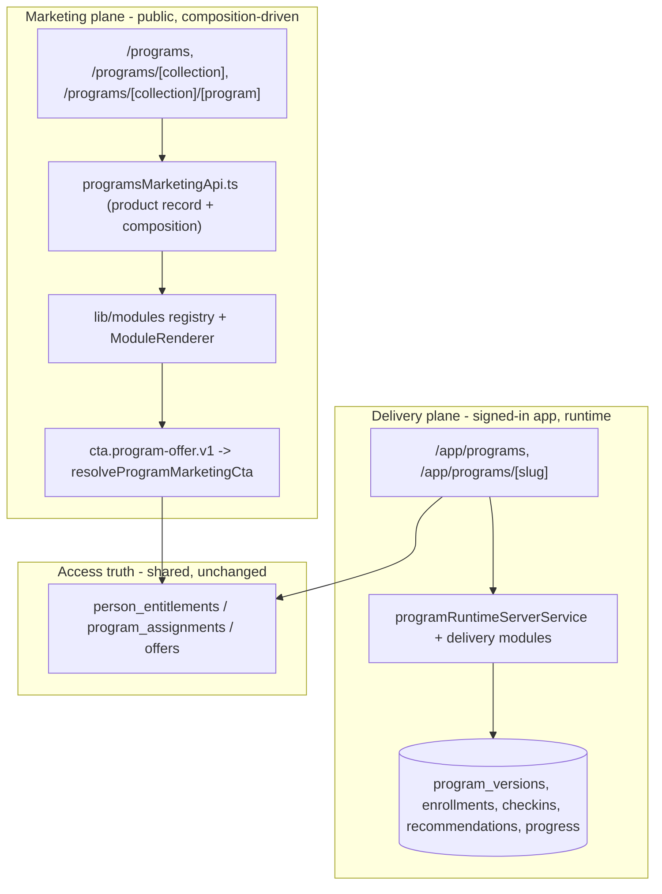

# Programs System Hardening v1 — Audit + Build Direction

Ack: message `2cc5f738-b290-478c-b5bb-e5210362cd7d`, thread `FD-SITE-MODULES:programs-system-hardening-v1`. Doctrine `7fb5e621-dfbc-49bf-bb45-488629696e3c`.

Confirmed decisions: (1) "Collection" = the existing "Series" layer — rename terminology in code/types/UI, keep `program_series` tables as storage; (2) keep centralized `resolveProgramMarketingCta()` as CTA/offer truth, surfaced via a program-aware CTA module.

## 1. Current-state audit (findings)

The system is more built-out than the doctrine framing implies. Two planes already exist but are uneven.

- Marketing plane (code-owned): `pages/programs.tsx`, `pages/programs/[series]/index.tsx`, `pages/programs/[series]/[program].tsx` render hardcoded JSX from `components/programs/*` using code catalogue `lib/programs/programSeriesCatalogue.ts` (DB-first via [lib/programs/programSeriesDeliveryServerService.ts](lib/programs/programSeriesDeliveryServerService.ts) over `program_series` + `program_series_items`, code fallback). CTA truth is centralized in `resolveProgramMarketingCta()` ([lib/programs/programSeriesCatalogue.ts](lib/programs/programSeriesCatalogue.ts)) → `/buy/{offerKey}`.
- Delivery plane (app-side): `/app/programs` and `/app/programs/[slug]` re-export `pages/journal/programs/*`. Owns enrollment, current day, progress, check-ins, recommendations, locks via [lib/programs/programRuntimeServerService.ts](lib/programs/programRuntimeServerService.ts), [lib/programs/runtimeTypes.ts](lib/programs/runtimeTypes.ts), [lib/programs/deliveryModuleDeliveryServerService.ts](lib/programs/deliveryModuleDeliveryServerService.ts), [lib/programs/baselineDeliveryModules.ts](lib/programs/baselineDeliveryModules.ts), backed by `program_versions`, `program_enrollments`, `program_checkin_*`, `program_recommendations`, `program_delivery_modules`, `program_content_progress`.
- Access: layered — `person_entitlements` (`program:<slug>`), `program_assignments`, `program_enrollments`; resolved in [lib/access/accessService.ts](lib/access/accessService.ts) and [lib/programs/programLibraryServerService.ts](lib/programs/programLibraryServerService.ts).
- Naming: `season`/`episode` are NOT used anywhere in the programs domain (constraint already satisfied). `series`, `program`, `version`, `module` (content + delivery), `pathway`, `sequence` are active. No first-class `collection` type.
- Schema lives in `scripts/**/*.sql` (no `supabase/migrations/`, no generated types). Row types are hand-maintained in server services.

Reference deep-dives: [lib/programs audit](880865d3-7328-4092-ac5b-6c5ec8dd8432), [marketing routes + components](0fbf3caa-ae14-4756-9705-3a73740cf83a), [integrative-care template](5a73c378-f613-43d4-91f2-9a5f8e22a781), [offers/entitlements/schema](27183949-fdfe-4ad5-a29e-9b44dbb993ae).

## 2. Target architecture (two planes)

Hard separation: marketing never reads PHI/runtime; delivery never owns marketing copy. Integrative Care / 1:1 practitioner care stays Practice Better/HIPAA-side and is only marketable/upsellable from Fine Diet (no Practice Better integration, no PHI moved).

## 3. Model: Category -> Collection -> Program -> Version -> Module

Collection is aliased onto today's Series. No schema rename of `program_series*` tables.

- Introduce canonical types: `lib/programs/programCollectionTypes.ts` (re-exports/renames from `programSeriesTypes.ts` — `ProgramCollectionDefinition`, `ProgramCollectionCategory`, etc.), keeping old names as deprecated aliases to avoid a big-bang break.
- Category: keep as the `category` attribute on collections for v1 (text + `ProgramCollectionCategory` union); document the option to promote to a first-class `program_categories` table later (NOT in v1).
- Reserve optional "Track" as a documented, unused future grouping slot. Do not introduce `season`/`episode` anywhere.
- Reconcile the dual registries flagged in audit: public catalogue (`programSeriesCatalogue`) vs app MVP (`appProgramsMvp`) use divergent slugs (`digestive-foundations` vs `digestive-reset`, etc.). v1 picks canonical slugs and aligns both.

## 4. Marketing template mirror of /integrative-care

Mirror the IC two-document pattern (`lib/integrativeCareApi.ts` + `lib/modules/`) for Programs.

- New `lib/programs/programsMarketingApi.ts`: Supabase `site_content` keys `product:programs:{slug}` and `composition:programs:{slug}`, JSON fallback under `data/products/programs/{slug}.json` and `data/compositions/programs--{slug}.json`. Mirrors getters/writers and draft/published lifecycle from [lib/integrativeCareApi.ts](lib/integrativeCareApi.ts).
- Reuse existing module runtime: `lib/modules/{types,schema,registry,fieldDescriptors}.ts` + [components/modules/ModuleRenderer.tsx](components/modules/ModuleRenderer.tsx).
- New CTA module honoring decision (2): add `cta.program-offer.v1` whose content references `{collectionSlug, programSlug?}` and renders via `resolveProgramMarketingCta()` so offer/checkout truth and coming_soon/disabled states stay centralized.
- Convert routes to composition-driven thin pages (parallel to `pages/integrative-care/[productSlug].tsx`), preserving current SEO `<Head>` and the existing presentational sections as registered modules where reuse is clean.
- Admin: clone IC admin pages/APIs under `/admin/programs-marketing/*` with the same publish + `res.revalidate()` flow.

## 5. App delivery requirements (kept separate)

Delivery plane owns and must remain the sole owner of: enrollment, current module/day, progress, completion, journal prompts, check-ins, audio/video modules, locks/unlocks, recommendations. No marketing copy authority. No PHI, test results, or practitioner messaging enters Fine Diet. Access decisions continue through `person_entitlements`/`program_assignments`; `resolveProgramMarketingCta` and enrollment gating remain the only offer/entitlement read paths — none are silently altered.

## 6. Migration path

1. Stage A (code-owned, safe-now): canonical Collection naming layer + slug reconciliation + program-aware CTA module + marketing template scaffolding reading existing code catalogue as fallback. No schema, no publishing changes.
2. Stage B (template adoption): move one Collection (Nutrition) and Baseline program page to composition-driven rendering with JSON-seeded compositions committed to the repo; keep code catalogue as fallback. Indexable parity + revalidate wired.
3. Stage C (Supabase/admin-backed, approval-gated): seed `site_content` rows, enable `/admin/programs-marketing/*` authoring, flip read order to DB-first. Requires schema/seed + publishing approval.

## 7. Safe-now vs approval-gated split

- Safe-now (no schema, no offer/publish changes): canonical Collection type aliases; slug reconciliation; `cta.program-offer.v1` module + registry wiring; `programsMarketingApi.ts` with JSON fallback only; JSON seed compositions in-repo; unit tests. 
- Requires approval (do NOT proceed without sign-off): any `scripts/*.sql` migration or new tables (e.g. promoting Category, or marketing `site_content` rows in prod); changing read order to DB-first in prod; admin publishing endpoints that write `site_content`; any change touching `offers`/`offer_entitlements`/entitlement keys. Per constraints, no migrations are written until schema state is confirmed and this plan is approved.

## 8. Tracked follow-up — Programs page-builder stabilization (NOT started)

Deferred by founder on 2026-06-26 to prioritize app-delivery planning. Existing published Programs Marketing pages (`/programs/nutrition`, `/programs/nutrition/baseline`) are correct and **remain live** — the defect is in the authoring round-trip, not the published output. No rollback needed.

Audited root cause (read-only, 2026-06-26): validation asymmetry between the save path and the load/render path.
- Save (`pages/api/admin/programs-marketing/[slug]/composition.ts` PUT) uses `pageCompositionSchema` → `moduleInstanceLooseSchema` (`content: z.record(...)`), which **accepts** empty/partial module content and stores it.
- Load + render (`getProgramsMarketingComposition` → `validateComposition` in [lib/programs/programsMarketingApi.ts](lib/programs/programsMarketingApi.ts)) strict-parses each module against `MODULE_CONTENT_SCHEMAS[type]` and **silently drops** any that fail.
- The composition editor's own `getServerSideProps` reloads through that strict path, so an added-but-incomplete module is stripped on reload and the next "Save draft" overwrites it away — added modules vanish with no feedback. Reordering already-valid modules survives (matches the founder's report). No current data corruption.

Required follow-up outcomes:
1. **Newly added modules must not disappear** — make the editor load/save path tolerant of in-progress modules (load raw/loose draft for editing; keep strict `validateComposition` only at the public render boundary) and surface validation feedback ("module X dropped: missing field Y") instead of silent drops. Scaffold default content on Add.
2. **Approved compositions become reusable starting templates** — a published composition should be promotable to a named starting template so new Collection/Program pages can fork it.
3. **Future admins should not start from scratch** — new Programs Marketing records should offer template selection rather than an empty composition.

Secondary: clarify default `surface` handling (icon-tiles defaults dark, cta.program-offer defaults light) and harden `feature.icon-tiles.v1`'s `?? 'dark'` against empty-string `surface`.

## Out of scope / prohibited
No Practice Better integration; no PHI/test-results/practitioner-comms into Fine Diet; no silent offer/entitlement truth changes; no `season`/`episode`; no migrations pre-approval.
